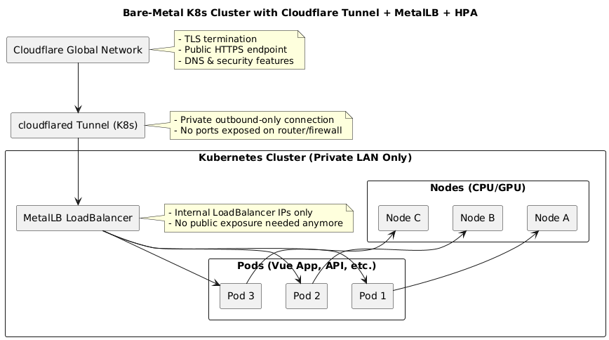
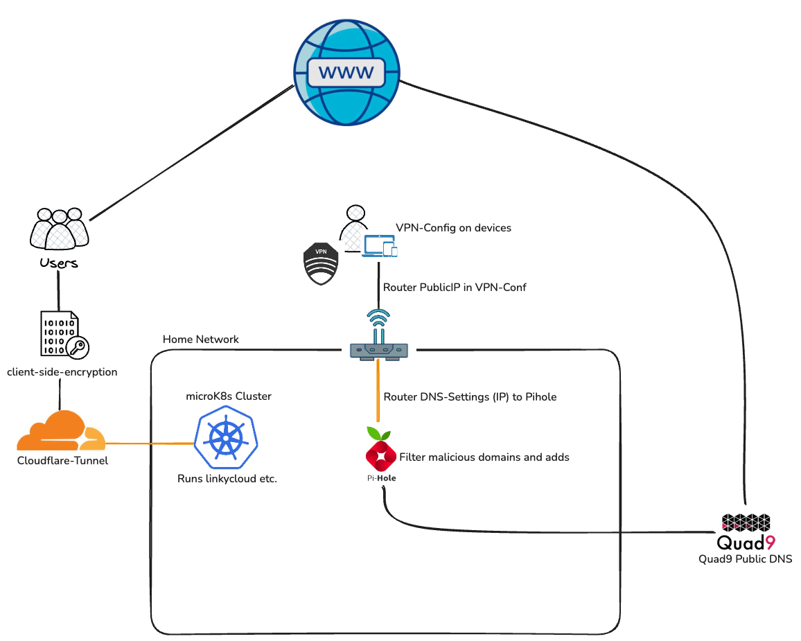
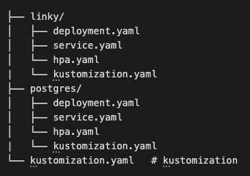

# MicroK8s Cluster

**This is a microK8s multi-node bare metal on-prem Cluster**

**Access:**

Via - Cloudflare Edge

---

### Nodes

- Node 1 = x86 Acer Computer 16gb RAM - linux (amd64) - Ubuntu 24.04.3 LTS
- Node 2 = RaspberryPi 4 4gb RAM - linux (arm64) - Ubuntu 24.04 LTS
- Node 3 = RaspberryPi 5 4gb RAM - linux (arm64) - Ubuntu 24.04 LTS

---

### Big Picture


### Big Picture with private home network
MicroK8s application frontends are securely exposed via a Cloudflare tunnel. To protect the rest of the home network, which is used only by a handful of people, do the following:

- VPN (OpenVPN via Synology NAS or Wireguard).
- Pihole to block adds and malicious domains.
- Pihole´s upstream DNS should be Quad9.



---

## Setup Multi-Node MicroK8s
- https://microk8s.io/
- https://microk8s.io/#install-microK8s

---

### Enable ssh on main node
```
sudo apt install openssh-server -y
sudo systemctl enable --now ssh
sudo systemctl status ssh
sudo ufw allow 22/tcp
```

<br>

### Use kubectl
```
echo "alias kubectl='microk8s kubectl'" >> ~/.bashrc
source ~/.bashrc
```

<br>

---

### How to connect Lens with the Cluster on your Computer
1. Get kube config - Execute this command on main node
```
microk8s config
```

2. Copy/paste config into kube config in you mac
```
nano ~/.kube/microk8s-config
```

<br>

### Use kubectl from mac
Install kubectl
```
brew install kubectl
```

Mount config
```
export KUBECONFIG=~/.kube/microk8s-config
```

<br>

### Optional: Make sure that the Ubuntu Computer Always run
- Prevent Ubuntu to go in sleep mode what normal computers do

Open config
```
sudo nano /etc/systemd/logind.conf
```

Change following settings
```
HandleLidSwitch=ignore
HandleLidSwitchDocked=ignore
```

Restart the service after save
```
sudo systemctl restart systemd-logind
```

<br>
<br>

### Add node for multi-cluster setup
On the control/main node (machine) in my case kube-main run following command to get the join command:
```
microk8s add-node
```

Response: `microk8s join 10.0.0.1:25000/<TOKEN>`

**On the second machine (another node)**

Install microk8s on the machine
```
sudo snap install microk8s --classic
```

Run join command `Response from the add-node command` --worker to tell microk8s that it is a worker node
```
microk8s join ip:25000/token --worker
```

Add Permissions (Recommended by terminal)
```
sudo usermod -a -G microk8s kube-second-raspi
newgrp microk8s
```

---

### Structure
For proper Kubernetes folder structure and more tips see: https://fluxcd.io/flux/guides/repository-structure/ and https://kubernetes.io/docs/concepts/configuration/overview/

Mine is following:




Deploy with:
```
kubectl apply -k .
```

---

### How to add secrets
```
kubectl create secret generic linky-secrets \
  --from-literal=VUE_APP_SUPABASE_URL=secret1 \
  --from-literal=VUE_APP_API_KEY=secret2
```

---

### Layers
HTTP (Vue app)
   ↑
TCP (transport protocol)
   ↑
IP  (network layer)

---

### Links
- How to deploy Vuejs App with Kubernetes: https://blog.openreplay.com/deploying-vue-apps-to-the-cloud-with-kubernetes/
- Cloud Native Foundation Landscape: https://landscape.cncf.io/ 

---

### LoadBalancer
microk8s enable metallb:192.168.178.50-192.168.178.60

---

### Reliability
- one pod dies → Kubernetes restarts it,
- one node dies → pods are rescheduled,
- one path fails on a node → MetalLB keeps routing to others,
- ISP changes IP → Cloudflare tunnel still works.

---

### Cloudflare Tunnel
Credentials saved to: /home/kube-main/.cloudflared/cert.pem

---

### Applications
Linky: https://github.com/Fabo011/Linky

---

### How to setup Pihole
https://docs.pi-hole.net/docker/
